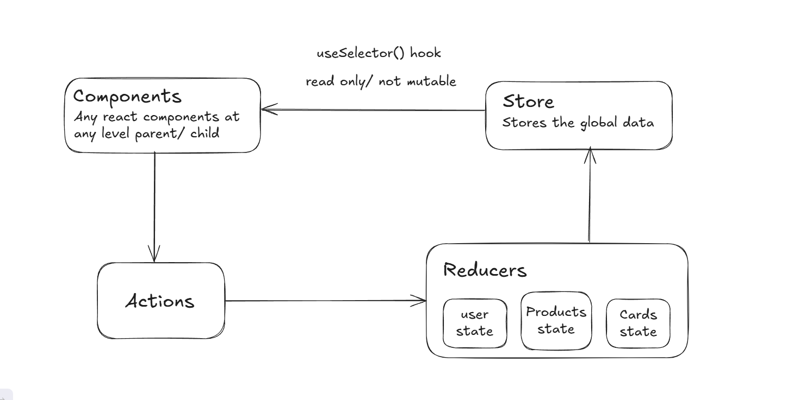

<h1>React Redux Introduction</h1>
<h3>Why redux:</h3>

In small apps, you can manage data using React's state. But as the app grows, it becomes tricky to pass data between many components. 

Redux solve this problem by creating a centeralize store that holds all the data. This store can be accessed and updated by any part of the app.

<h3>What is Redux?</h3>

Redux is a tool that helps maage data (aslo known as "state") in large React apps.

It allows us to keep all our app's data in a single place. known as the redux store, making it easy to share and update data across different parts of the app.

<h3>How Redux Works?</h3>

<b>1) Store:</b> this is where Redux keeps all your data.

<b>2) Action:</b> this is an object, which tell the redux what to do (like adding a task).

<b>3) Reducer:</b> How to do It actually change the data in the store based on the actions.

<h3>Store</h3>

the Redux store is like a big box where all your applications data is kept safe. Everything you do with Redux-whether adding, removing, or updating data-goes through this store

<h3>Action</h3>

this is an object, which tell the redux what to do (like adding a task).

<pre>
{
    type:"counter/add",
    payload:{
        incrementBy:10,
    }
}
</pre>

<pre>
{
    type:"counter/decrement",
    payload:{
        decrementBy:10,
    }
}
</pre>

<h3>Reducer</h3>

How to do It actually change the data in the store based on the actions.

<pre>
export const counterReducer = (state = initialState, action)=>{
    switch (action.type){
        case "counter/add":
            return
                {...state, value: state.value + action.payload.incrementBY };
        default:
            return state;
    }
}
</pre>

<h1>Redux Advantages</h1>
<h3>Centralize State Management</h3>

Redux stores your app's state in one place. making it easier to manage and access data across components.

<h3>Global Access</h3>

Any component can access and update the state without passing props down.

<h3>Predictable Updates</h3>

State changes are controlled and predictable using reducers.

<h3>DevTools</h3>

Powerfull tools for debugging, inspecting state, and replaying actions.

<h3>Async Support</h3>

Middleware like Thunk or Saga handles async tasks, keeping the code clean.

<h1>Resux Thunk</h1>
<h3>What is Resux Thunk?</h3>

Redux Thunk is middleware that allows you to write action creators that return a function instead of an action. This function can perform asynchronous logic (like API requests) and dispatch actions after the operation is completed (e.g., fetching tasks and then dispatching them to the store).

when you return a funtion from an action creator, Redux Thunk Provides the dispatch function as an argument. This allows you to manually dispatch other actions (e.g., when an API call succeeds or fails.)

<h1>Resux Toolkit</h1>
<h3>How it's work</h3>
